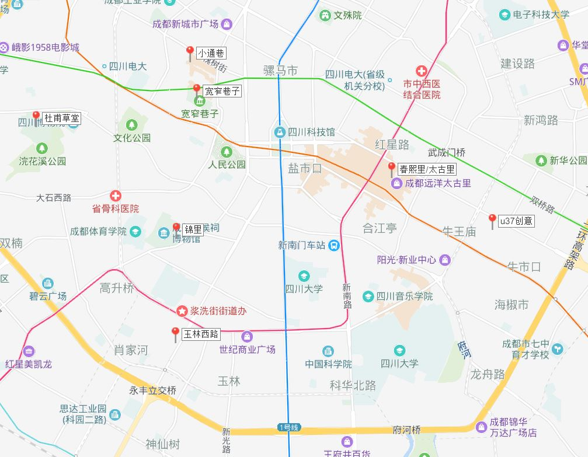

## 重庆

**景点**

- 洪崖洞：2.1km，巴渝吊脚楼，易傍晚，欣赏
- 磁器口：商业古镇，吃吃逛逛，
- 观音桥：步行街，商圈，小吃
- 解放碑-八一路：逛街，吃
- 南山一棵树：爬山观山城全景，落日，夜景
- 十八梯+山城步道：石阶石街，山城老重庆，白天，江景
- 中山四路：国民历史遗迹，白天
- 鹅岭二厂：文创

**路线**

- Day0: 好好休息:crescent_moon:
- Day1：
    - 上午： 磁器口，留好大胃口
    - 下午： 中山四路，散步回程休息
    - 傍晚： 解放碑吃饭+逛街
    - 晚上： 洪崖洞
    - 午夜： 美美地睡一觉:clock12:
- Day2:
    - 上午： 晚起，吃饭
    - 下午： 十八梯+山城步道
    - 傍晚： 南山一棵树，看夜景
    - 晚上： （待定）大吃一顿
    - 午夜： 美美地睡一觉:clock12:
- Day3:
    - 上午： 晚起，赶火车去成都

**住宿**

- 民宿名：懒懒
- 房间号：42-15
- 路线图：

## 成都

**春熙路+太古里**：商业街

**方所书店**-太古里

**宽窄巷子**： 傍晚/晚上

**锦里**: 民俗商业步行街/古街

**玉林西路**：小酒馆/参观/傍晚

**大熊猫繁育基地**：乘坐9路车到动物园站，换乘87路或者198路至熊猫基地站即到

**东郊广场**：前苏联援建的办公楼、红砖厂房、火车头和铁轨等构成了如今这一创意园区，视觉冲击力强，怀旧意味浓郁

**小通巷**：宽窄巷子附近，慢生活小巷